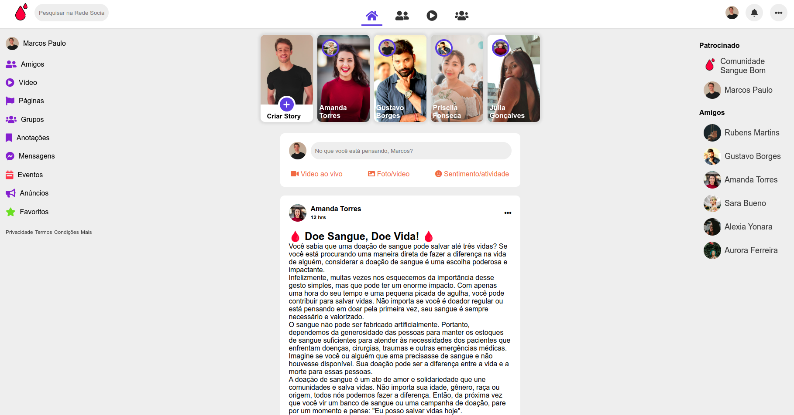

<h1 align="center">
Enterprise Challenge - Social Life Ring
</h1>

Projeto desenvolvido a partir dos módulos estudados do curso Sistema para Internet

Esta rede social tem como foco principal a integração de funcionalidades que promovam o engajamento dos usuários em ações e projetos relacionados aos Objetivos de Desenvolvimento Sustentável (ODS) estabelecidos pela Organização das Nações Unidas (ONU).

O Projeto Sangue Bom é uma rede social que visa promover a interação entre pessoas que fazem doação de sangue, semelhante ao Facebook. A plataforma facilita a conexão entre doadores, receptores e instituições de saúde, incentivando a prática da doação de sangue através de campanhas e informações relevantes. 

  <a href="#-tecnologias">Tecnologias</a>&nbsp;&nbsp;&nbsp;|&nbsp;&nbsp;&nbsp;
  <a href="#-layout">Aplicação</a>&nbsp;&nbsp;&nbsp;|&nbsp;&nbsp;&nbsp;
  <a href="#memo-licença">Licença</a>

  

 

    

## 🚀 Tecnologias

Esse projeto foi desenvolvido com as seguintes tecnologias:

- HTML5
- CSS3

## 🔖 Aplicação

Você pode visualizar a aplicação do projeto através [DESSE LINK](https://fiap-enterprise-challange-social-life-ring.vercel.app/)

## :memo: Licença

Esse projeto está sob a licença MIT.

---

Feito com ♥ by [Gisele Araujo Silva](https://www.linkedin.com/in/gisele-araujo-silva/) e [Vitória Ferreira](https://www.linkedin.com/in/vic-ferreira/)
